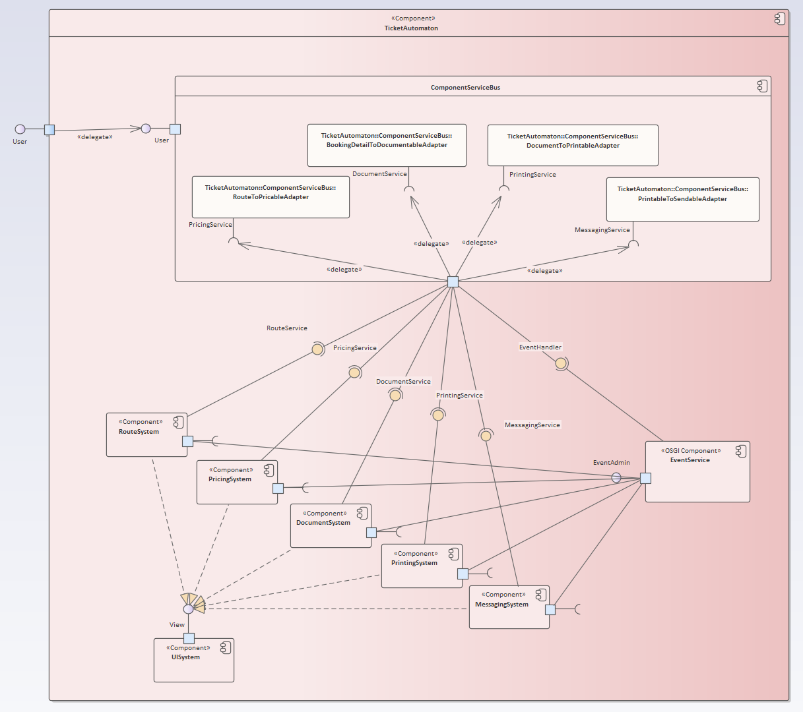

# TicketAutomaton (OSGI)
A ticket automaton that is part of the component oriented software architecture course at our university. The automaton consists of
multiple components, each one of them realized as an osgi bundle.

## Authors
- [@Tonnanto](https://www.github.com/Tonnanto)
- [@Plploe](https://github.com/Plploe)

---
## Development Process

1. The detail of requirements for this system was very limited.
2. Neither did we have prior knowledge of this domain nor did we have contact to someone who does.

This led to many of our architectural decisions result in a compromise between the given requirements and our personal understanding of a useful system that makes sense in this domain.

___
## Architecture
This automaton consists of multiple osgi bundles. The **component-service-bus** bundle acts as the entry point for the "Buy Ticket" use case and coordinates the interactions between the 5 domain components.
Each domain component (osgi bundle) utilizes the Event Admin Service Specification to publish events that are caught in the ComponentServiceBus.
The `structure` package contains domain specific types and their relations.
The `behaviour` package contains a service interface and a default implementation of such.
The service interface has methods that represent the use cases of this module.
The service implementations also manage user interaction (utilizes the iService Component to display an appropriate view).

### Components:

